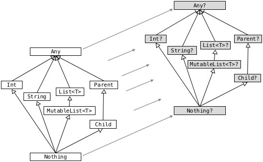

=== Kotlin fundamentals

Kotlin is fundamentally an object-oriented language.
This, along with the constraints imposed by the JVM, means that classes and data will be structured in much the same way as in Java, C++, or any other object-oriented language.

Kotlin's primary advantage to developers is that it manages to be extremely expressive while remaining fairly short;
for example, Kotlin code is completely semicolon-free!

==== Files

Unlike many other languages, the Kotlin compiler has the additional concept of a "file".
Whereas all symbols in Java or C# must either be or be contained in _classes_, Kotlin allows properties and functions to be declared at the _top level_:

[source,kotlin]
----
class Test {}

val foo = "This is a top-level property"
fun thisIsATopLevelFunction() {}
----

Top-level symbols are placed in the current package's scope, unless they are ``private`` --
private top-level symbols are only visible within the same file.
They can be imported with ``[package-name].[symbol-name]``, similarly to classes:

[source,kotlin]
----
// File A
package a

val foo = "This is a top-level property"

// File B
package b
import a.foo

fun main() = println(foo) // "This is a top-level property"
----

Kotlin files typically have the extension `.kt`.

The Kotlin compiler, `kotlinc`, supports dynamic execution of _Kotlin scripts_.
Kotlin scripts have the extension `.kts` and do not require a `main` function; top-level statements are allowed and executed.

==== Getting started

You can download ``kotlinc``'s binaries https://github.com/JetBrains/kotlin/releases/tag/v1.3.61[here].
If you prefer package managers, you can also install it
https://www.archlinux.org/packages/community/any/kotlin/[with ``pacman`` (Arch Linux)],
https://formulae.brew.sh/formula/kotlin[Homebrew] (macOS/Linux),
https://snapcraft.io/kotlin[Snappy] (primarily Ubuntu), or https://chocolatey.org/packages/kotlinc[Chocolatey] (Windows).

`kotlinc` isn't necessary to compile or run Kotlin code, though.
JetBrains' https://www.jetbrains.com/idea/download/[IntelliJ IDEA], unsurprisingly, has first-class Kotlin support built in to the IDE.
An easy way to play around with Kotlin is to create a `.kts` _scratch file_ (kbd:[Ctrl+Alt+Shift+Insert]).
If you want to create a full Kotlin project, you can easily do so by using JetBrains'
https://mvnrepository.com/artifact/org.jetbrains.kotlin/kotlin-archetype-jvm[Kotlin Maven archetype]
or by selecting "Kotlin/JVM" in the Gradle project creation dialog.
This will generate a full, working Maven project for you with a sample Kotlin entry point and test class.

While there exists an equivalent plugin for https://marketplace.eclipse.org/content/kotlin-plugin-eclipse[Eclipse], it unfortunately tends to be updated quite infrequently, is prone to bugs, and is usually out of date.

==== ``new``

Kotlin does not have a ``new`` operator. Constructors are called using standard function-call syntax:

[source,kotlin]
----
val person = Person("Test", "Testerson")
----

NOTE: This is a nice time-saver, and is consistent with C++ syntax --
``new`` is used to allocate dynamic memory, call a constructor, and return a pointer;
or to otherwise create the object on the stack and return an rvalue.
As there is no real functional distinction between heap- and stack-allocated values on the JVM, since one generally does not have to deal with pointers,
there is no reason to keep the keyword.

==== ``?``

`?` is an integral part of Kotlin's type system; `?` designates a type as _nullable_:

[source,kotlin]
----
val foo1: String = "bar"  // ok
val foo2: String? = "bar" // ok
val foo1: String = null   // ERROR
val foo2: String? = null  // ok
----

Non-nullable types cannot have the value `null` assigned to them!
This is one of Kotlin's advantages -- it is extremely difficult to write proper Kotlin code that throws a `NullPointerException`.

Nullable types come with
https://kotlinlang.org/docs/reference/null-safety.html[their own useful utilities].

`?.`, the _safe call_ operator, can be used to perform operations on nullable values.
If the value is `null`, it performs the operation; otherwise, it too returns `null`.
This is useful for chaining methods on values that may be null:

[source,kotlin]
----
val input: String? = readLine()
val enteredInt =
    input           // String?
    ?.trim()        // String? -> String?
    ?.toIntOrNull() // String? -> Int?

if (enteredInt == null) println("You did not enter an integer")
----

The Elvis operator (`?:`, try turning it 90° clockwise) is frequently used as the last element in a `?.` chain to return a fallback value.
The result of an `?:` expression returns the left operand if it is not `null`; otherwise, it returns the right operand.

TIP: This is equivalent to the `??` operator in C#.

[source,kotlin]
----
val envvar: String? = System.getProperty("FOO")
val displayValue: String = envvar ?: "No value found" // Not nullable!

if (enteredInt == null) println("The value of FOO is: $displayValue")
----

If you _really_ need to force the compiler to dereference a nullable value, the `!!` operator can be used for this purpose:

[source,kotlin]
----
val maybeFoo: Foo? = retrieveMaybeFoo()
val foo = maybeFoo!!
----

CAUTION: Note that this will throw an exception if the value is indeed `null`.
Unless you are dealing with complex scenarios (e.g. reflection) where you can be _absolutely sure_ that a value will not be null, **never** use this operator.
There is always a better way to solve nullability issues.

==== ``Unit``

Kotlin, like many functional languages, does not have the concept of "no return type"; every function must return a value.
So how do we deal with `void` methods?

Kotlin represents the https://en.wikipedia.org/wiki/Unit_type[unit type] as
https://kotlinlang.org/api/latest/jvm/stdlib/kotlin/-unit/index.html[Unit].
This is equivalent to `()` in Rust or Haskell, and `Unit` in Swift.
`Unit` is a singleton value that holds no information, making it a perfect choice for methods that return nothing.
It is automatically returned from blocks of code that do not contain a `return` expression:

[source,kotlin]
----
val value = run {}
println(value) // kotlin.Unit
----

It also plays extremely well with generics!
Previously, to create a `void`
https://docs.oracle.com/en/java/javase/13/docs/api/java.base/java/util/concurrent/Callable.html[Callable]
in Java, one would have to specify the type parameter as ``void``'s peculiar wrapper type,
https://docs.oracle.com/en/java/javase/13/docs/api/java.base/java/lang/Void.html[Void], and then manually return `null` from the implementation of the `call` method:

[source,java]
----
new Callable<Void>() {
    Void call() {
        foo();
        return null;
    }
}
----

This is redundant!
Since there exist no valid instances of `Void`, there is no use in returning any sort of value.
Furthermore, the client of this API would need to know to discard the returned value.

Fortunately, since `Unit` is implicitly returned, all we need to do in Kotlin is:

[source,kotlin]
----
Callable<Unit> { foo() }
----

This also enables function chains returning `Unit` to compose nicely.

NOTE: This particular example makes use of <<anonobj,SAM conversions>>.

==== ``Nothing``

While https://kotlinlang.org/api/latest/jvm/stdlib/kotlin/-nothing.html[Nothing] as a type is fundamentally similar to `Void`, they are extremely different in terms of usage.

A function returning `Nothing` will never return.
This is primarily used for functions that will always throw exceptions (i.e. exception helpers), or that will loop forever.
All statements following an expression that returns `Nothing` will never execute:

[source,kotlin]
----
fun throwDataException(error: String): Nothing {
    throw DataException("SQL error: $error")
}

try {
    doDatabaseStuff()
} catch(e: SQLException) {
    throwDataException(e.message)
    foo() // Warning: unreachable code
}
----

This is used quite effectively in the standard library by the utility function
https://kotlinlang.org/api/latest/jvm/stdlib/kotlin/-t-o-d-o.html[TODO], often used during development to mark sections of code that are not implemented and should throw an error.

[source,kotlin]
----
if (foo()) {
    handleFoo()
} else {
    // Not done with this yet
    TODO("handleNotFoo()")
    //^ NotImplementedError: "An operation is not implemented: handleNotFoo()"
}
----

TIP: Since ``Nothing`` cannot hold a value, and ``T?`` is a union between ``T`` and ``null``, the type ``Nothing?`` can be used to hold a value that is always null.

==== ``Any``

``Any`` is Kotlin's equivalent to https://docs.oracle.com/en/java/javase/13/docs/api/java.base/java/lang/Object.html[Object] -- it is the implicit base class for all types.
It is functionally equivalent to ``Object``, except that most of its methods have been removed:

- ``clone``
* Implement ``Cloneable`` instead, if you _really_ need ``clone``.
- ``finalize``
- ``wait``, ``notify``, ``notifyAll``
* Use of these methods has been discouraged for years -- Kotlin has simplified things by removing them outright.
- ``getClass``
* This method has been replaced by the ``::class`` operator.

If you need to use any of ``Object``'s methods, you can force the compiler to make them visible by casting an object to ``Object``:

[source,kotlin]
----
val foo = ...
(foo as java.lang.Object).notify()
----

==== Kotlin's type hierarchy

The base type for all other types in Kotlin is `Any`.
All nullable types are subtypes of their respective non-nullable types.
This is important since it allows nullable types to hold a regular, non-null value.

`Nothing`, the type discussed earlier, is at the bottom of the type hierarchy; it is considered a subtype of every other type, meaning that a variable of type `Nothing` cannot be implicitly assigned to.

The only expressions in Kotlin that return `Nothing` are:

- `return`
- `throw`
- `continue`
- `break`

Yes, `return` returns a value!
This allows us to extremely easily handle precondition failures, and is a very common Kotlin idiom:

[source,kotlin]
----
fun login(user: User): Boolean {
    val username = user.name ?: return false // User has no name, don't try to log in
    val token = doLogin(user) ?: throw LoginException("Could not log in")
    return true // Success
}
----

In this case, `?:` will either return the preceding value or execute the right-hand expression, forcing the function to return prematurely without too much boilerplate code.
This can also be used with `continue` or `return` to prematurely end the loop body.

Of course, this allows us to write meaningless code:

[source,kotlin]
----
return return throw return throw throw return return throw return
----

While the compiler will warn that each of the expressions (except the last) is unreachable, this is valid code.

TIP: It should hopefully be clear that code like this should never be written.

==== Statements and expressions

Generally, _expressions_ are snippets of code that have a _value_.
Statements, on the other hand, do not necessarily have any sort of resulting value.

Apart from declarations and assignments, everything in Kotlin is an expression:

[source,kotlin]
----
val password = readLine()
val output = when (password) {
    "hunter2" -> "Authenticated!"
    else -> "Hacker detected!"
}
----

Even an `if` statement returns a value:

[source,kotlin]
----
println(
    if (room.isSmoking) "This is a smoking room"
    else "This is a no-smoking room"
)
----

This is incredibly versatile, since it is possible to place multiple statements within the `if` statement's block --
every _block_ in Kotlin also returns a value!

NOTE: Because ``if`` is an expression, Kotlin does not have the ``? :`` ternary operator.

The result of the last statement in a block implicitly becomes the result of the block itself.
If the last statement is not an expression, it returns `Unit` instead:

[source,kotlin]
----
val value = run {
    val foo = 40
    foo + 2
}
print(value) // 42
----

TIP: Unlike in most other C-like languages, assignments are not expressions.
This means many classic sources of programmer error can be eliminated:

[source,c]
----
_Bool ok = doSomething(...);
if (ok = true) { // = instead of ==, this will always get executed!
    printf("Success\n");
} else {
    // This will never get executed!
    printf("An error occured\n");
    abort();
}
----

==== Visibility modifiers

Kotlin has the following visibility modifiers:

- ``public``
- ``internal``
- ``protected``
- ``private``

``public``, ``protected`` and ``private`` members work as they do in Java and C++.
``private`` _top-level symbols_ are visible everywhere in the same file.

TIP: Top-level symbols cannot be ``protected``, as this would not make any sense -- they do not have anything to do with inheritance.

Unlike Java, Kotlin does not have package-private (default) access.
It replaces this with ``internal`` access, which makes a symbol visible to all other classes _in the same module_.
Files outside a project (i.e. in other modules) will not be able to access an ``internal`` symbol.

IMPORTANT: The **default access modifier** for a symbol, when one is not specified, is ``public``!
This means specifying ``public`` explicitly is almost always redundant.

==== Hello, world!

As with any other programming language, to write an executable program we need an entry point.
A Kotlin program's entry point is a top-level function called `main`.
As many programs do not make use of command-line arguments, the `args` parameter is optional.
This means a "hello world" program could look something like:

[source,kotlin]
----
fun main(args: Array<String>) {
    println("Hello, world!")
}
----

or

[source,kotlin]
----
fun main() {
    println("Hello, world!")
}
----

Our
https://en.wikipedia.org/wiki/Code_golf[golfing] opportunities don't end here, though.
In the interest of enabling terse, functional programming, there exists a shorter syntax for functions that consist of and return a single expression:

[source,kotlin]
----
fun main() = println("Hello, world!")
----
